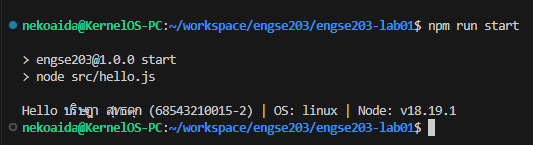

# ENGSE203 LAB 01 — Developer Environment & GitHub Repository Setup

## ผู้จัดทำ

- ชื่อ-นามสกุล: ปริษฎา สุทธดุก
- รหัสนักศึกษา: 68543210015-2
- ระบบปฏิบัติการที่ใช้: macOS / Windows

## วัตถุประสงค์ของงาน

- 

## เครื่องมือที่ใช้

- 

## วิธีติดตั้งและรัน

```bash
npm install
npm run start
```

## โครงสร้างไฟล์

```text
.
├── src/
├── package.json
└── README.md
```

## หลักฐานผลลัพธ์



## ปัญหาที่พบและวิธีแก้ไข

- ปัญหา: -
- วิธีแก้: -

## References & AI Assistance

- Source / Documentation: https://github.com/se-rmutl/engse203-lab/tree/main/labs/week-01-developer-environment-git-github
- AI tool used: -
- Used for: Education
- My adaptation: -
